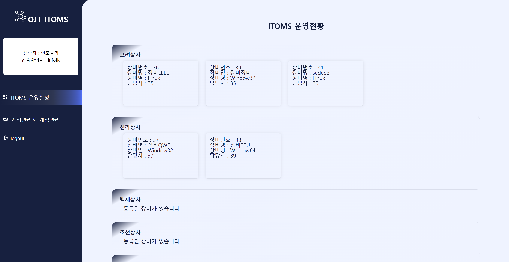
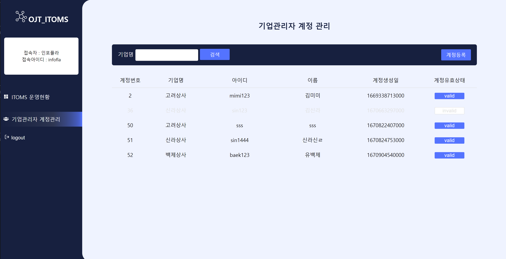
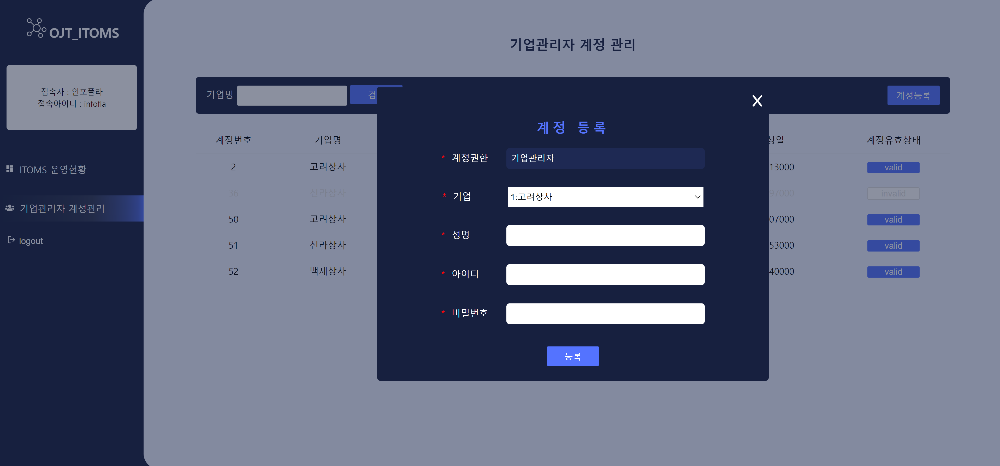
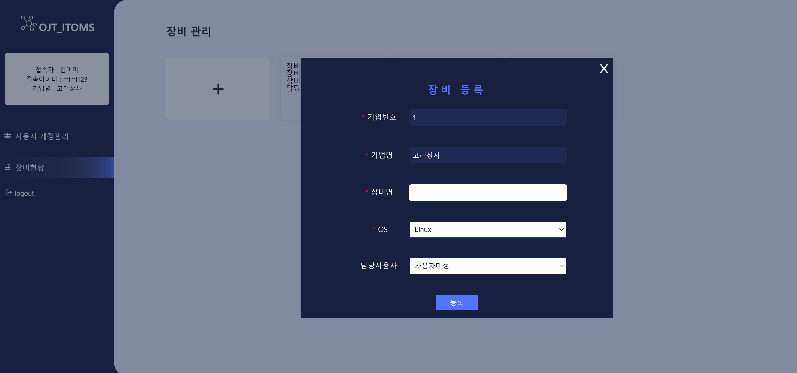

# GraphQL 학습프로젝트
- [ 프로젝트 기술스택 ]   
Backend : nodejs, graphql_apolloServer    
DB : mariadb   
Frontend : react, apolloClient      
mobile : reactNative     

- [ 요구사항 정의 ]    
계정권한은 사이트관리자, 기업관리자, 사용자 세 분류.   
사이트관리자는 각 기업별 등록된 장비와 기업관리자계정을 관리할 수 있다.    
기업관리자는 본인이 소속된 기업에 등록된 장비와 사용자계정을 관리 할 수 있다.   
사용자는 본인계정에 할당된 장비를 관리 할 수 있다.
    ```
    +추가 필요한 기능 : 기간별검색기능, 장비그룹단위 관리
    기업의 기간별 등록된 장비의 개수와 등록된 계정의 총계를 확인 할 수 있다.
    장비는 개별로 사용자에게 할당되는 것이 아닌, 장비그룹단위로 할당되어 관리된다.
    ```

- [ ERD ]  


---
## Backend

### GraphQL Schemas,Types 정의
- Query
  ```
    loginMember(id:String!,password:String!): Auth

    getAllRole: [Role]
    getAllCompany:[Company]

    getAllDeviceByParams(params:Params): [Device]
    getMemberByParams(params:MemberParams): [Member]
    getCompanyByParams(params:CorpParams) : [Company]
    
    # 수정필요..
    getAllDeviceByCompany: [DeviceByCompany]
    getAllMemberByRole(role:Int!): [Member]
    getAllMemberByRoleAndCorp(role:Int!,companyName:String!): [Member]
    getAllMemberByRoleAndCorpNo(role:Int!,companyNo:Int!): [Member]
    getDeviceByCompany: [Device]
  ```
- Mutation
  ```
  createMember(
            role_no: Int!
            company_no: Int
            name: String!
            id: String!
            password: String!
        ): String!

        updateMember(
            member_no:Int!
            isavailable:Boolean!
        ): String!

        createDevice(
            company_no:Int!
            member_no:Int!
            os:String!
            device_name:String!
        ) : Device

        updateDevice(
            device_no:Int!
            device_name:String!
            os:String!
            member_no:Int!
        ): Device

        createCompany(
            company_name:String!
            business_number:String!
        ): String!

  ```
- Object type
  ```
  type Auth {
        token:String!
        memberData: Member!
    }
    type Role {
        role_no:Int!
        role_name:String!
    }

    type Member {
        member_no:Int!
        role_no:Int!
        company_no:Company
        id: ID!
        name: String!
        reg_date:String!
        isavailable:Boolean!
    }

    type Company{
        company_no:Int!
        company_name:String!
        business_number:String!
        device_total:Int!
    }

    type Device {
        device_no:Int!
        company_no:Int!
        member_no:Int!
        os:String!
        device_name:String!
        reg_date:String!
    }

    type DeviceByCompany {
        company_name:String!
        business_number:String!
        company_no: [Device]
    }
  ```
- input type
  ```
    input Params{
        company_no:Int
        member_no:Int
    }

    input MemberParams{
        role_no:Int
        company_no:Int
        member_name:String
        company_name:String
    }

    input CorpParams{
        company_name:String
        business_number:String
    }
  ```


<div>


</div>
---
## FrontEnd
- 사이트관리자계정
<div>



</div>

- 기업관리자계정  
<div>


</div>
<div>


</div>

- 사용자계정
<div>

</div>

### 문서구조
```
index.js ─ GlobalStyles.js
         ─ App.js ─ Home.js
                  ─ LoginPage.js
                  ─ Main.js ─ Contents.js ─ DashBoard.js
                                          ─ MemberManager.js - CreateMember.js
                                          ─ DeviceManager.js ─ CreateDevice.js
```
---
## ReactNative

<div>


</div>
<div>


</div>

- 사이트관리자계정으로 접속
```
       (Tab Navigatior) (Stack.Navigator)
Login ─ Home ─────────── LoginMember 
      ─ DashboardStack ─ Dashboard
                       ─ AddCompany
                       ─ DeviceManager 
                       ─ AddDevice
      ─ MemberStack    ─ MemberManager
                       ─ AddMember
```

- 기업관리자계정으로 접속
```
       (Tab Navigatior) (Stack.Navigator)
Login ─ Home ──────── LoginMember 
      ─ DeviceStack ─ DeviceManager
                    ─ AddDevice
      ─ MemberStack ─ MemberManager
                    ─ AddMember

```
- 사용자계정으로 접속
```
       (Tab Navigatior) (Stack.Navigator)
Login ─ Home ──────── LoginMember 
      ─ DeviceManager 
```

---
## 수정사항 체크리스트
### BackEnd
- [ ] 로그인페이지 에러처리
- [ ] 쿼리에 order by reg_date desc 추가
- [ ] 
### FrontEnd
- [ ] 사이트관리자 ITOMS운영현황페이지_담당자 번호->담당자이름 으로 표출되도록 백엔드 수정
- [ ] 
### ReactNative
- [ ] 
---


## Error Note
```javaScript
    getCompany({
            variables:null,
            onCompleted:(_,data)=>{console.log("성공")},
            onError:(error)=>{
                console.log({...error});
                console.log(error.networkError.result.errors);
            }
        });
```